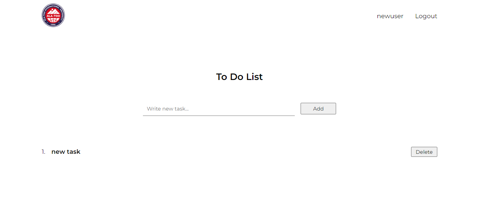
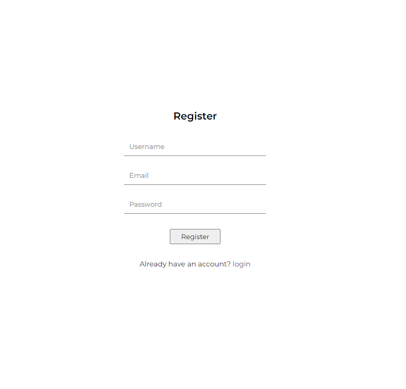
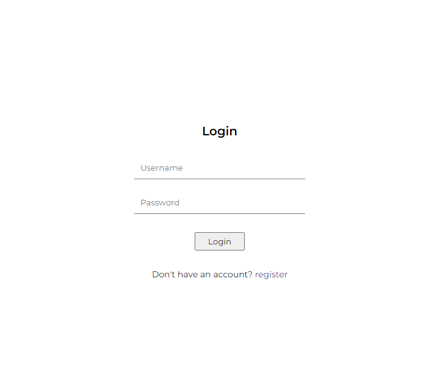

# To Do List

This project made by Emazov

## Installation

_I have some problems with deploy react app thats's why you should start react app on localhost_ 

#### Backend part deployed on Vercel

Link to backend repo - https://github.com/Emazov/todo-nodejs-backend

#### For start you should Clone or Download repo - https://github.com/Emazov/react_mysql_blog

---

## Available Scripts

##### `npm i`

Create - node_modules - folder

#### `npm start`

Runs the app in the development mode.\
Open [http://localhost:3000](http://localhost:3000) to view it in your browser.

---

## Screenshots

- Home page 

There are the logo of AIU, your _Username_ and _Logout_ button \
You can Add your _Tasks_ and Delete them

_For visit this page You should login or register_

- Register page

Unique _Username_\
Mail should be from AIU \
Password mustn't be less than 6 symbols

- Login page

Write your username and password

